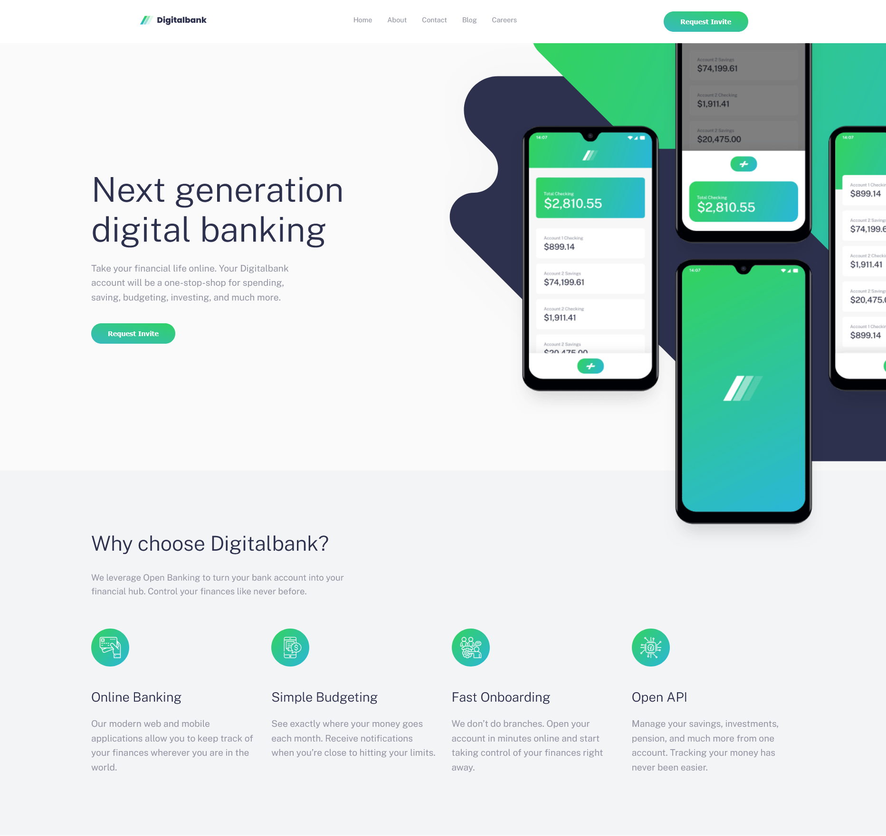
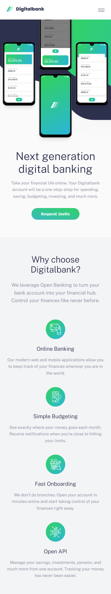

<h1 align="center" id="title">Bank Digitalbank</h1>

<p align="center"></p>

<p id="description">
Landing Page for a modern digital banking application (Digitalbank). A fully responsive project, optimized for mobile, tablet, and desktop devices, utilizing modern CSS Grid and Flexbox techniques.
</p>

## 📺 Demo

[Demo Link](https://bank-landing-page-zeta-two.vercel.app/) <!-- Replace with your Vercel/Netlify link if deployed -->

## 🖼️ App Preview




## 🧐 Features

Here are the main features of the project:

*   **Fully Responsive (RWD)** – The site looks great on any device (Mobile, Tablet, Desktop).
*   **Mobile Menu** – Interactive hamburger menu with animations.
*   **Modern Layout** – Utilizes CSS Grid and Flexbox for complex layouts (Hero, Features, Articles, Footer).
*   **Interactive States** – Hover effects for buttons, links, and article cards.
*   **SCSS** – Modular styling code using variables and nesting.

## 🚀 Quick Start

1. **Clone the repository**:
   ```bash
   git clone https://github.com/DevvMarko/bank_landing_page.git
   ```

2. **Install dependencies**:
   Navigate to the project folder and run:
   ```bash
   npm install
   ```

3. **Run the development server**:
   ```bash
   npm run dev
   ```
   Open the browser at the address shown in the terminal (usually `http://localhost:5173`).

## 🛠️ Build for Production

To build an optimized production version:
```bash
npm run build
```

## 💻 Technologies Used

Technologies used in the project:

*   HTML5 (Semantic)
*   SCSS (Sass)
*   JavaScript (ES6+ Modules)
*   Vite (Build Tool)

## ✍️ Author

Project created by [@DevvMarko](https://github.com/DevvMarko). Check out my website at [mbarchanski.pl](https://mbarchanski.pl).
