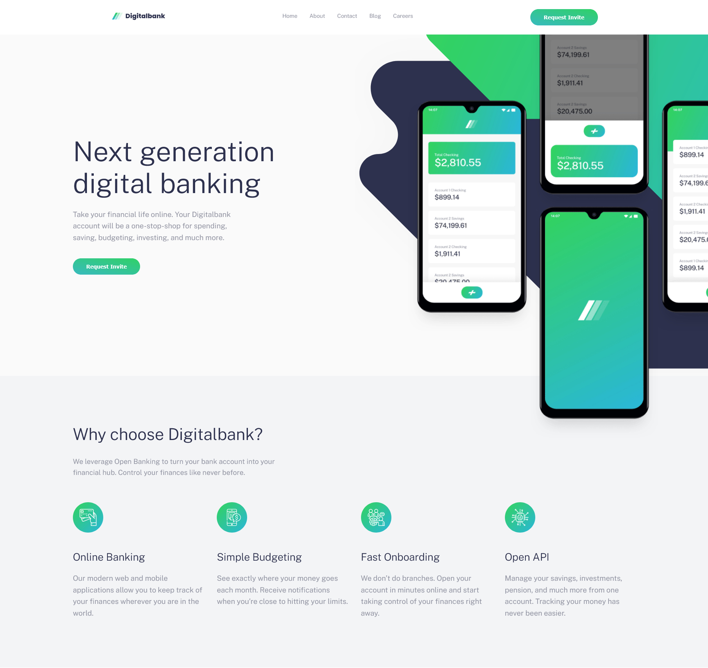
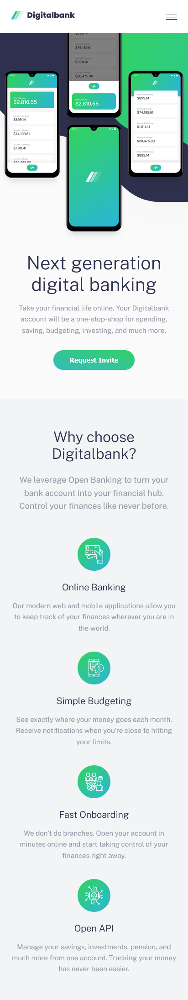

#  Bank Digitalbank - Landing Page

Landing Page for a modern digital banking application (Digitalbank). A fully responsive project, optimized for mobile, tablet, and desktop devices, utilizing modern CSS Grid and Flexbox techniques.

> **Live Demo:**
> Check out the live project here: [Bank Landing Page](https://bank-landing-page-phi.vercel.app/)

---

## Screenshots

| Desktop View | Mobile View |
|:---:|:---:|
|  |  |


## Features

* **Fully Responsive (RWD):** The site looks great on any device (Mobile, Tablet, Desktop).
* **Mobile Menu:** Interactive hamburger menu with animations.
* **Modern Layout:** Utilizes CSS Grid and Flexbox for complex layouts (Hero, Features, Articles, Footer).
* **Interactive States:** Hover effects for buttons, links, and article cards.
* **SCSS:** Modular styling code using variables and nesting.

## Tech Stack

* 
* 
* 
* 

---

## Local Development

To run the app in debug mode or modify the code:

### Prerequisites
* Node.js

### Steps
1. Clone the repository:
   ```bash
   git clone https://github.com/DevvMarko/bank_landing_page.git
   ```
2. Install dependencies:
   ```bash
   npm install
   ```
3. Start the project
   ```bash
   npm run dev
   ```
4. Open the browser at the address shown in the terminal (usually `http://localhost:5173`).

---

## Build for Production

To build an optimized production version:
```bash
npm run build
```

---

## Author

Project created by [@DevvMarko](https://github.com/DevvMarko) and I invite you to visit the author's portfolio page [mbarchanski.pl](https://mbarchanski.pl)
